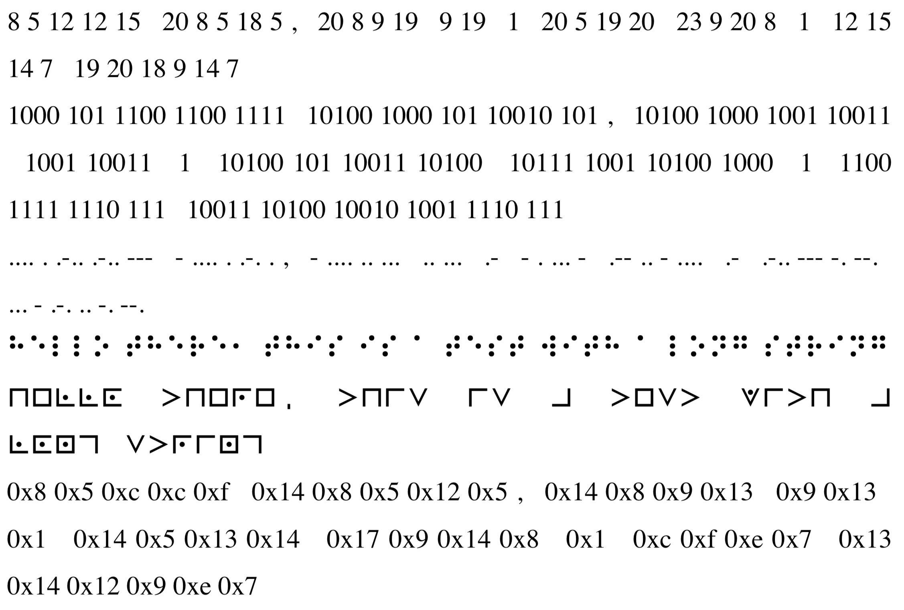

# FNC41 encoder script

Encoder script inspired by [Field Notes Clandestine](https://fieldnotesbrand.com/products/clandestine) notebook.

The script uses the `pyfpdf` [library](https://github.com/reingart/pyfpdf) to create a PDF file with the encoded message.

Run with the `example1` argument to generate an example PDF with all possible encodings. Run with the `example2` argument to generate an example PDF where each word is randomly encoding. When run without an argument it prompts for an encoder type and message.

```
> python3 fnc41_encoder.py example1
- writing decimal
- writing binary
- writing morse
- writing braille
- writing pigpen
message written to 'example.pdf'
```

## Fonts

The following fonts are used for braille and pigpen:
- https://www.dafont.com/braille.font
- http://www.babelstone.co.uk/Fonts/Pigpen.html BabelStonePigpen

## Example


